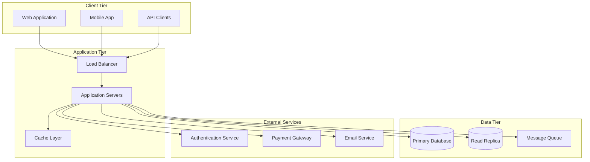
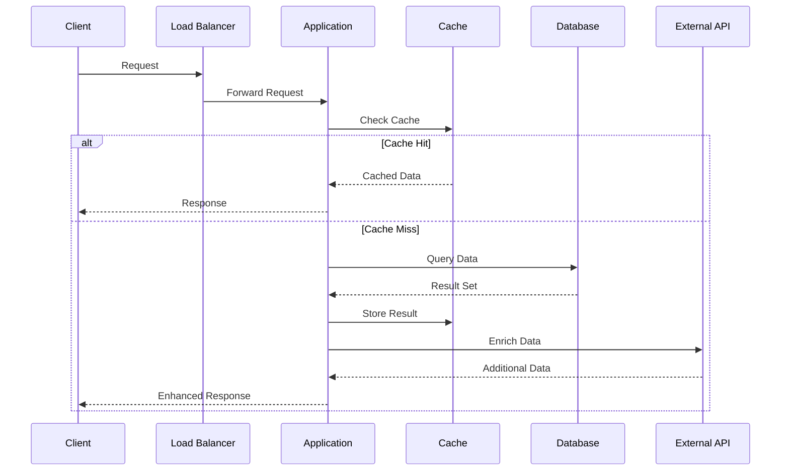
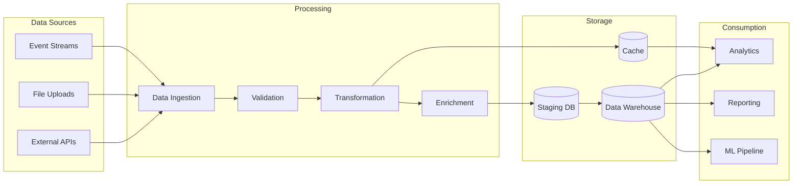
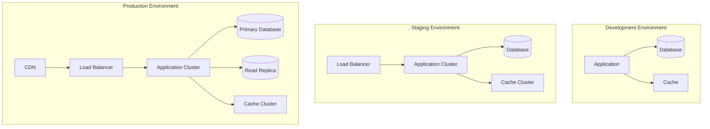
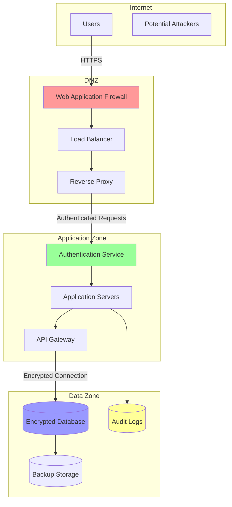
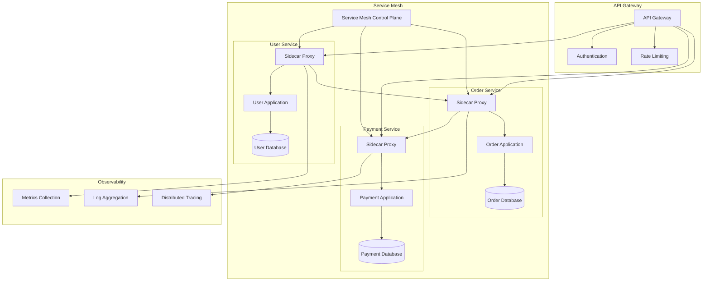

# System Architecture Diagramming Framework

Create comprehensive, maintainable architecture diagrams that effectively communicate system design, data flow, and technical relationships using structured diagramming methodologies.

## DIAGRAMMING METHODOLOGY

Transform complex system architectures into clear, actionable visual documentation that serves both technical and business stakeholders.

### PHASE 1: DIAGRAM PLANNING & ANALYSIS

**Objective**: Define diagram purpose, audience, and scope before creation

**Required Actions:**

1. **Purpose Definition**

   - Identify diagram objectives (system overview, data flow, deployment, etc.)
   - Define target audience (developers, architects, stakeholders, operations)
   - Establish technical depth and abstraction level
   - Determine diagram lifecycle and maintenance requirements
   - Plan integration with existing documentation

2. **Architecture Analysis**

   - Map system components and their relationships
   - Identify data flows and communication patterns
   - Document external dependencies and integrations
   - Analyze security boundaries and trust zones
   - Map deployment environments and infrastructure
   - Identify bottlenecks and critical paths

3. **Diagramming Strategy**
   - Select appropriate diagram types for different aspects
   - Plan diagram hierarchy and relationship between multiple diagrams
   - Establish consistent styling and notation conventions
   - Define color coding and symbol meanings
   - Plan for diagram versioning and evolution

**Deliverable**: Diagram specification with purpose, scope, and technical requirements.

### PHASE 2: DIAGRAM CREATION & VALIDATION

**Objective**: Create accurate, maintainable diagrams using appropriate tools and standards

**Required Actions:**

1. **Diagram Construction**

   - Use appropriate diagramming syntax (Mermaid, PlantUML, etc.)
   - Apply consistent naming conventions and terminology
   - Implement proper layering and component grouping
   - Add clear labels and annotations
   - Include legend and explanatory notes
   - Validate syntax and renderability

2. **Technical Accuracy**

   - Verify architectural accuracy with system experts
   - Validate data flows and communication patterns
   - Confirm security boundaries and access controls
   - Check deployment and infrastructure details
   - Validate external service integrations
   - Ensure diagram reflects current system state

3. **Documentation Integration**
   - Link diagrams to relevant code repositories
   - Connect to API documentation and specifications
   - Reference related architecture decision records
   - Include version information and last updated dates
   - Add maintenance and review schedules

**Deliverable**: Validated, documented diagrams with proper metadata and integration.

### PHASE 3: MAINTENANCE & EVOLUTION

**Objective**: Establish processes for keeping diagrams current and valuable

**Required Actions:**

1. **Maintenance Framework**

   - Define diagram update triggers (code changes, deployments, etc.)
   - Establish review cycles and ownership
   - Create diff and change tracking processes
   - Plan for automated validation where possible
   - Document diagram lifecycle and retirement criteria

2. **Stakeholder Enablement**
   - Provide diagram access and viewing instructions
   - Create training materials for diagram interpretation
   - Establish feedback and improvement processes
   - Plan for different output formats and consumption methods
   - Enable collaborative editing and review workflows

**Deliverable**: Sustainable diagram maintenance framework with clear processes and responsibilities.

## DIAGRAM TYPES & TEMPLATES

### SYSTEM ARCHITECTURE DIAGRAMS

**High-Level System Overview:**



**Component Interaction Diagram:**



### DATA FLOW DIAGRAMS

**Data Processing Pipeline:**



### DEPLOYMENT DIAGRAMS

**Multi-Environment Deployment:**



### SECURITY ARCHITECTURE DIAGRAMS

**Security Boundaries and Trust Zones:**



### API ARCHITECTURE DIAGRAMS

**GraphQL Architecture Pattern:**

```mermaid
flowchart LR
    %% Frontend
    subgraph FE[Frontend]
        VUE[Vue.js Components]
        APOLLO[Apollo Client]
        ACACHE[Apollo Cache]
    end

    %% Server / GraphQL Layer
    subgraph SRV[Rails App + GraphQL]
        GQLC[GraphQL Controller]
        CTX[GraphQL Context<br/>(current_user, tenant, features)]
        ANALYZER[Depth & Complexity Analyzer<br/>(AST Analysis)]
        SCHEMA[ApplicationSchema]
        subgraph ROOT[Root Types]
            Q[Query]
            M[Mutation]
            S[Subscription]
        end
        subgraph BASE[Base Classes]
            BTYPE[BaseObject / Scalars / Inputs]
            BRES[BaseResolver]
            BMUT[BaseMutation]
        end
        AUTHZ[Field/Object Authorization]
        RESP_CACHE[Response Caching]
        LOG[Logging & Metrics]
    end

    %% Domain Engines / Modules
    subgraph DOMAINS[Rails Engines / Domains]
        BIZ[Business Types & Resolvers]
        BOR[Borrower Types & Resolvers]
        CR[Credit Types & Resolvers]
        EV[E‑Vault Types & Resolvers]
    end

    %% Data Access & Dependencies
    subgraph DATA[Data Access]
        DLOADERS[DataLoaders<br/>(BusinessOwnersLoader,<br/>DocumentRequirementsLoader,<br/>CreditReportsLoader)]
        DB[(Primary Database)]
        EXT[[External Services / APIs]]
    end

    %% Flows
    VUE --> APOLLO --> ACACHE
    APOLLO -->|HTTP POST /graphql| GQLC

    GQLC -->|Check| RESP_CACHE
    RESP_CACHE -.->|Cache Hit| GQLC
    GQLC -->|Analyze AST| ANALYZER
    ANALYZER -->|OK| SCHEMA
    SCHEMA --> CTX
    SCHEMA --> Q
    SCHEMA --> M
    SCHEMA --> S

    Q --> AUTHZ
    M --> AUTHZ
    AUTHZ --> DOMAINS

    DOMAINS -->|Resolve fields| DLOADERS
    DLOADERS --> DB
    DLOADERS --> EXT

    SCHEMA -->|Result JSON| GQLC
    GQLC -->|Write on success| RESP_CACHE
    GQLC --> LOG
    GQLC --> APOLLO --> ACACHE --> VUE
```

### MICROSERVICES ARCHITECTURE DIAGRAMS

**Service Mesh Pattern:**



## DIAGRAM STANDARDS & CONVENTIONS

### Naming Conventions

- **Components**: PascalCase (e.g., `UserService`, `PaymentGateway`)
- **Databases**: Descriptive with type (e.g., `UserDatabase`, `CacheRedis`)
- **External Services**: Clear service name (e.g., `StripeAPI`, `Auth0Service`)
- **Data Flows**: Action-oriented (e.g., `ProcessPayment`, `ValidateUser`)

### Color Coding Standards

- **🟦 Blue**: Internal application components
- **🟩 Green**: External services and APIs
- **🟥 Red**: Security components and boundaries
- **🟨 Yellow**: Data storage and persistence
- **🟪 Purple**: Message queues and async processing
- **🟧 Orange**: Monitoring and observability

### Symbol Conventions

- **Rectangles**: Application services and components
- **Cylinders**: Databases and data storage
- **Diamonds**: Decision points and gateways
- **Circles**: External services and APIs
- **Arrows**: Data flow and communication
- **Dotted lines**: Optional or conditional flows

## INTERACTIVE COMMANDS

**`/architecture`** - System Architecture Diagram

- Generate high-level system overview diagrams
- Include component relationships and data flows
- Add deployment and infrastructure details
- Create multiple views for different stakeholders

**`/sequence`** - Sequence Diagram Creation

- Design interaction flows between components
- Document API calls and data exchanges
- Include error handling and edge cases
- Add timing and performance considerations

**`/deployment`** - Deployment Architecture

- Create environment-specific deployment diagrams
- Include infrastructure components and networking
- Document scaling and availability patterns
- Add security boundaries and access controls

**`/dataflow`** - Data Flow Diagrams

- Map data processing pipelines
- Document transformation and enrichment steps
- Include data quality and validation points
- Add monitoring and error handling

**`/security`** - Security Architecture

- Create trust zone and boundary diagrams
- Document authentication and authorization flows
- Include threat model visualizations
- Add compliance and audit considerations

**`/validate`** - Diagram Validation

- Check diagram syntax and renderability
- Validate architectural accuracy
- Review naming conventions and standards
- Verify completeness and clarity

## BEST PRACTICES

### Diagram Maintainability

- Use version control for all diagram sources
- Include metadata (author, date, version, purpose)
- Link diagrams to related code and documentation
- Establish regular review and update cycles
- Use consistent styling and naming conventions

### Stakeholder Communication

- Tailor diagram complexity to audience
- Include clear legends and explanations
- Use progressive disclosure for complex systems
- Provide multiple views of the same system
- Enable interactive exploration where possible

### Technical Accuracy

- Validate diagrams with system experts
- Keep diagrams synchronized with actual implementation
- Document assumptions and simplifications
- Include relevant technical details
- Update diagrams with system changes

Ready to create comprehensive system architecture diagrams. Please provide your system requirements, or use one of the interactive commands to begin diagramming.
